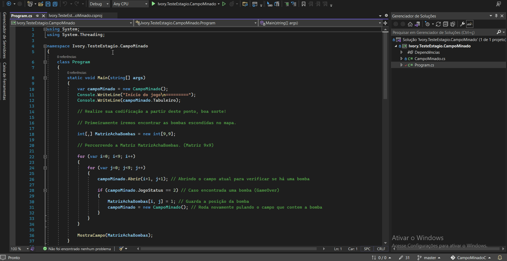

<h1 align="center">
    <a> Desafio Ivory Talent 2022 </a>
</h1>

<h3 align="center">
    <a href="https://github.com/ivory-it/ivoryit-testeestagio-campo-minado" alt="Desafio Ivory Talent 2022"> Campo Minado </a>
</h3>
 

---

### ⚒ Tecnologias utilizadas

-   **[.net core SDK 3.1](https://dotnet.microsoft.com/download/dotnet-core/thank-you/sdk-3.1.201-windows-x64-installer)**
-   **[Git](https://git-scm.com/)**

 

---

### 💻 Ambiente de desenvolvimento

-   **[Visual Studio 2022](https://visualstudio.microsoft.com/pt-br/)**

 

---

### 🦾 Teste unitário

#
- Desafio: Campo Minado

### ✒️ Autor

 

<a href="https://github.com/gabriel61">
 
  
 
 
 
sogabris@gmail.com
 

---
